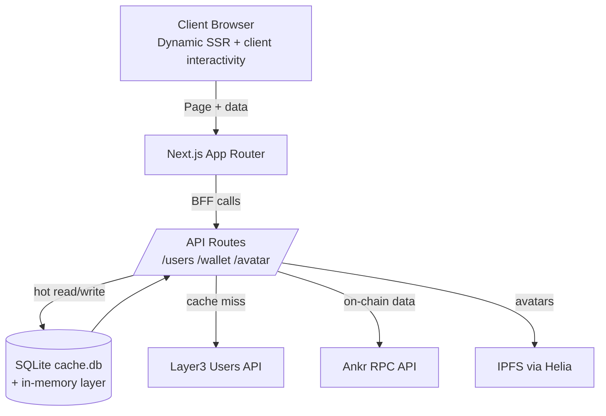

# Layer3 Top Users — Project Doc

Concise overview for reviewers: what it does, how it’s built, and how to operate it. For setup/commands, see `README.md`.

Live demo: https://top-layer3-users.sgtpooki.com/

## Summary
- Next.js App Router app showing Layer3’s top users with wallet/NFT/tx data.
- BFF API routes proxy Layer3, Ankr, and IPFS; all responses cache through memory → SQLite → CDN.
- Focus: fast cold starts, low upstream calls, secure key handling, pragmatic tests (unit + E2E smoke).

## Architecture

## Data & Ops Notes
- Cache: `data/cache.db` (with WAL files) via `better-sqlite3`; 24h TTL for users, wallet payloads, and avatar CIDs. In-memory maps layer on top for hot reads; expired rows cleared on startup or overwrite.
- Cache headers: `s-maxage=60, stale-while-revalidate=120` for CDN/edge caching; pages use dynamic rendering.
- Flushing cache: stop the app and delete `data/cache.db*` to force fresh fetches.
- Routes: `/api/users` (Layer3 users, cached), `/api/wallet/[address]` (Ankr, cached), `/api/avatar/[cid]` (IPFS, CID allowlist cached). Pages: `/` leaderboard, `/user/[address]` detail.

## Key Decisions (why it matters)
- BFF over direct client calls: protects keys, enables validation and caching; minor extra hop accepted.
- Dynamic rendering + layered caching (SQLite + HTTP): better TTFB and upstream protection; data can be ~1 minute stale via HTTP cache.
- Client/server split: wallet data fetched server-side via BFF; UI is mostly server components with client islands for interactivity.
- IPFS via Helia singleton: reduces connect overhead; CID allowlist from cached user data to avoid arbitrary fetches.
- Validation: `viem.isAddress` for EVM addresses; Helia handles CID validation.

## Performance Posture
- Parallel upstream fetches (`Promise.all`) and cached BFF responses.
- Next.js Image for avatars/NFTs; fall back to `unoptimized` when domains are unknown.
- Small client bundles by keeping most components server-side; client islands for filtering/interactivity.

## Security Posture
- Secrets only on server (`.env`, git-ignored). API keys never exposed to client.
- Proxy sets CSP, X-Frame-Options, X-Content-Type-Options.
- Basic input validation on addresses; CID access constrained by cached allowlist/fail-fast fetch.

## Testing Posture
- Unit: lib utilities (`token-utils`, `explorers`).
- E2E: Playwright smoke (`homepage.spec.ts`) for render/navigation.
- API routes and cache layer are exercised indirectly; could add targeted cache tests if needed.

## Improvements I didn't get to
1) Add cache-behavior tests (save/read/expiry) and API route contract tests.
2) Skeleton loaders and error boundaries for smoother UX.
3) Pagination or infinite scroll for large token/NFT sets.

## Production Readiness Considerations (intentionally omitted)

The following items are standard for production systems but were intentionally omitted here. They're documented to demonstrate awareness of production concerns:

- **Rate limiting**: Unnecessary given the caching strategy—all responses are cached (24h DB + 60s HTTP), and we only fetch from Layer3's limited top users list. Upstream API calls are minimal and infrequent.
- **Monitoring/Observability**: Metrics (Prometheus), distributed tracing (OpenTelemetry), and error tracking (Sentry) are standard but unnecessary for a demo app. Basic logging via `logger` should suffice.
- **Health checks**: `/api/health` endpoint for load balancer checks would be standard but not needed here.
- **Database migrations**: Schema versioning/migrations would be needed for production but SQLite schema is stable for this use case.
- **Structured logging**: Current logger outputs to console; production would use structured JSON logs with log aggregation (e.g., Datadog, CloudWatch).

## Appendix: Project Structure (quick reference)
- `app/` — Next.js App Router; `api/users`, `api/wallet`, `api/avatar`; pages `/` and `/user/[address]`.
- `components/` — UI (TopUserView, WalletInfo, Token/NFT cards, etc.).
- `lib/` — API integrations (`wallet.ts`, `users.ts`), caching (`db.ts`), explorers, token utils.
- `data/` — Runtime SQLite artifacts (`cache.db`, WAL).
- `e2e/`, `__tests__/` — Playwright + Vitest.
